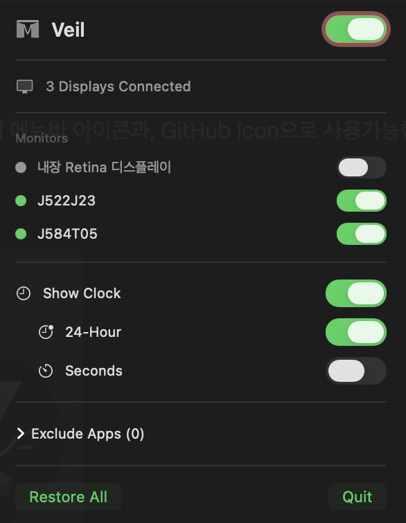
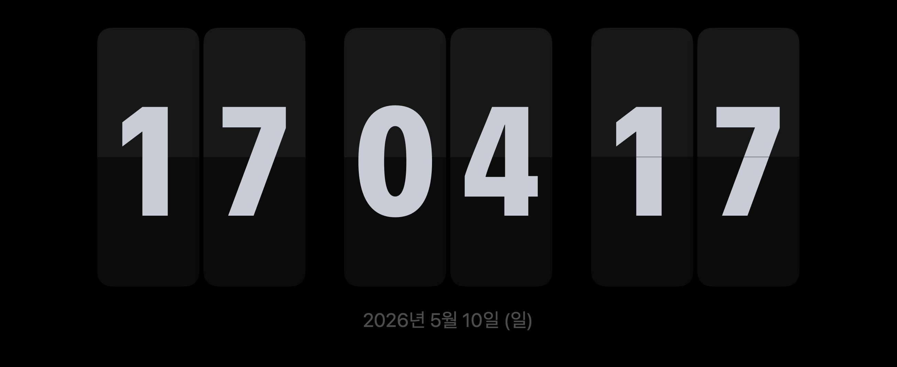

<div align="center">


# Veil

**Softly blanks other monitors when fullscreen video is detected on macOS**

[](https://github.com/neocode24/veil/releases)
[](https://github.com/neocode24/homebrew-tap)
[](https://www.apple.com/macos/)
[](https://swift.org)
[](LICENSE)

**Language** · English · [한국어](docs/ko-KR/README.md) · [日本語](docs/ja-JP/README.md)

<br>


&nbsp;&nbsp;


</div>

---

## Features

- **Auto-detection** — Detects fullscreen video playback on any monitor via CoreGraphics
- **Soft blank** — Instantly overlays inactive monitors with a black veil
- **FlipClock** — Optional clock display on veiled monitors
- **Lightweight** — Lives in the menu bar, no Dock icon, near-zero CPU at idle
- **Custom apps** — Add or exclude any app from detection via the menu bar UI

## Install

### Homebrew (Recommended)

```bash
brew tap neocode24/tap
brew install --cask veil
```

### Manual

Download the latest `.zip` from [Releases](https://github.com/neocode24/veil/releases) and drag `Veil.app` to `/Applications`.

> **Note:** On first launch, grant Accessibility permission:  
> System Settings → Privacy & Security → Accessibility → Enable Veil

## How It Works

1. Veil monitors all windows using CoreGraphics APIs
2. When a known media app enters fullscreen, it identifies the active monitor
3. Every other connected monitor gets a black overlay (soft-off / veil)
4. When fullscreen exits, all monitors are instantly restored

## Supported Apps

| Category   | Apps |
|------------|------|
| Browsers   | Safari, Chrome, Firefox, Arc, Edge |
| Players    | VLC, QuickTime, IINA, mpv, Infuse, Plex |
| Streaming  | Netflix, Disney+, Prime Video, Apple TV |
| Video Call | Zoom, FaceTime |

Custom apps can be added or excluded from the **menu bar UI**.

## Monitor Control

Each connected display can be individually toggled from the menu bar:

- **Green dot** — Active, will be veiled when fullscreen is detected
- **Orange dot** — Currently veiled
- **Gray dot** — Excluded from veiling

## Build from Source

```bash
# Requirements: Xcode 16, XcodeGen
brew install xcodegen

make setup   # Generate Xcode project
make build   # Build release binary
```

```bash
# Release workflow
make package   # Build + zip artifact
make release   # Package + create GitHub release

# Tag-based CI release
git tag v0.2.0
git push origin v0.2.0
```

## Requirements

| Requirement | Version |
|-------------|---------|
| macOS       | 14.0+ (Sonoma) |
| Xcode       | 16.0+ |
| Swift       | 5.9+ |

## License

[MIT License](LICENSE) © 2024 neocode24
