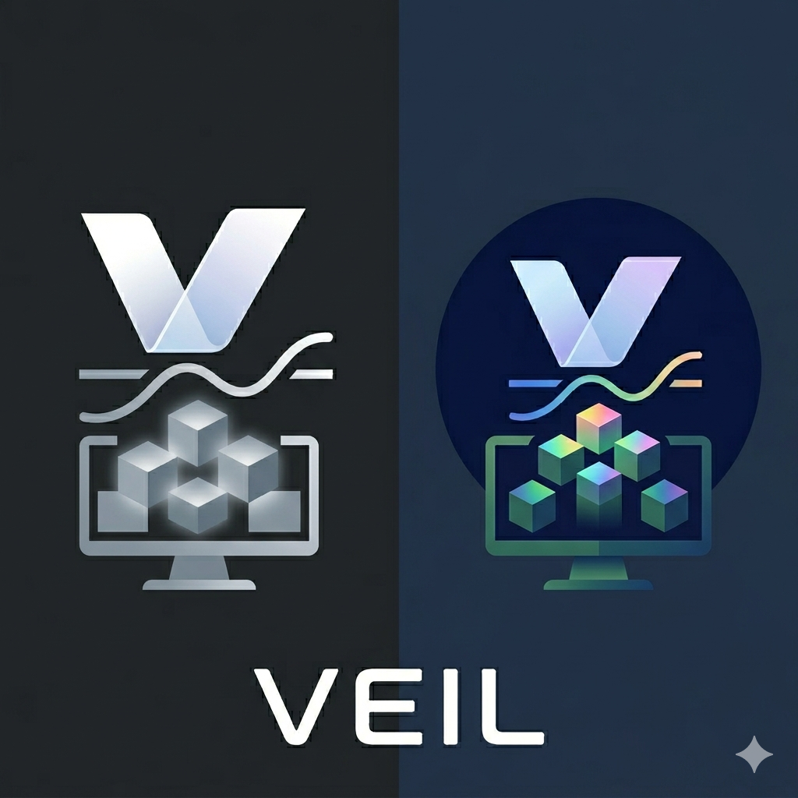

<div align="center">



# Veil

**フルスクリーン動画検出時に他のモニターをそっとブランクするmacOSアプリ**

[](https://github.com/neocode24/veil/releases)
[](https://github.com/neocode24/homebrew-tap)
[](https://www.apple.com/macos/)
[](https://swift.org)
[](LICENSE)

**言語** · [English](../../README.md) · [한국어](../ko-KR/README.md) · 日本語

<br>


</div>

---

## 主な機能

- **自動検出** — CoreGraphics APIで任意のモニターのフルスクリーン動画再生を自動検出
- **ソフトブランク** — 非アクティブなモニターを即座に黒いベールで覆う
- **FlipClock** — ベールが適用されたモニターにオプションで時計を表示
- **軽量動作** — メニューバーで常駐、Dockアイコンなし、アイドル時のCPU使用量はほぼゼロ
- **カスタムアプリ** — メニューバーUIから検出対象のアプリを追加・除外可能

## インストール

### Homebrew（推奨）

```bash
brew tap neocode24/tap
brew install --cask veil
```

### 手動インストール

[Releases](https://github.com/neocode24/veil/releases)から最新の`.zip`をダウンロードし、`Veil.app`を`/Applications`にドラッグしてください。

> **注意:** 初回起動時にアクセシビリティ権限の許可が必要です:  
> システム設定 → プライバシーとセキュリティ → アクセシビリティ → Veilを有効化

## 動作の仕組み

1. VeilがCoreGraphics APIですべてのウィンドウを監視
2. 対応メディアアプリがフルスクリーンに入ると、アクティブなモニターを特定
3. その他すべての接続モニターに黒いオーバーレイ（ベール）を適用
4. フルスクリーン終了時にすべてのモニターを即座に復元

## 対応アプリ

| カテゴリ   | アプリ |
|------------|--------|
| ブラウザ   | Safari, Chrome, Firefox, Arc, Edge |
| プレイヤー | VLC, QuickTime, IINA, mpv, Infuse, Plex |
| ストリーミング | Netflix, Disney+, Prime Video, Apple TV |
| ビデオ通話 | Zoom, FaceTime |

**メニューバーUI**からカスタムアプリを追加・除外できます。

## モニター制御

メニューバーから各接続ディスプレイを個別にトグル:

- **緑のドット** — アクティブ状態、フルスクリーン検出時にベールが適用される
- **オレンジのドット** — 現在ベール適用中
- **グレーのドット** — ベール適用から除外

## ソースからビルド

```bash
# 要件: Xcode 16, XcodeGen
brew install xcodegen

make setup   # Xcodeプロジェクトを生成
make build   # リリースビルド
```

```bash
# リリースワークフロー
make package   # ビルド + zip圧縮
make release   # パッケージ + GitHub Releaseを作成

# タグベースのCIリリース
git tag v0.2.0
git push origin v0.2.0
```

## 動作要件

| 項目    | バージョン |
|---------|-----------|
| macOS   | 14.0+（Sonoma） |
| Xcode   | 16.0+ |
| Swift   | 5.9+ |

## ライセンス

[MIT License](../../LICENSE) © 2024 neocode24
