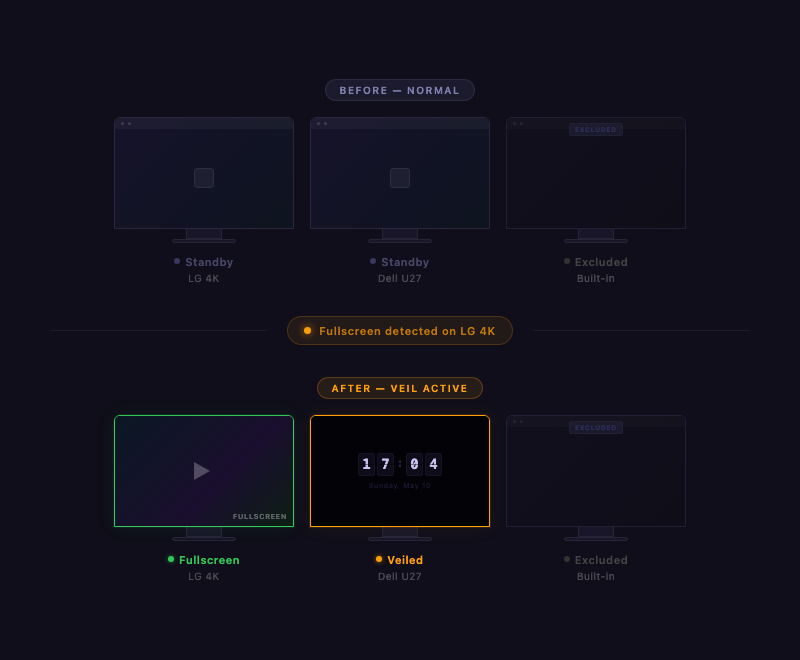
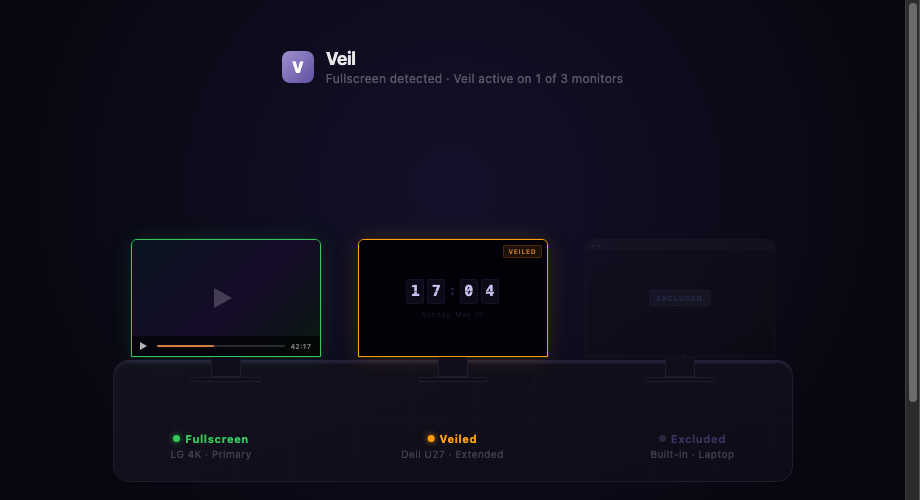

<div align="center">


# Veil

**전체화면 영상 감지 또는 단축키로 즉시 다른 모니터를 부드럽게 가려주는 macOS 앱**

[](https://github.com/neocode24/veil/releases)
[](https://github.com/neocode24/homebrew-tap)
[](https://www.apple.com/macos/)
[](https://swift.org)
[](LICENSE)

**언어** · [English](../../README.md) · 한국어 · [日本語](../ja-JP/README.md)

<br>





</div>

---

## 주요 기능

- **자동 감지** — CoreGraphics API로 모든 모니터의 전체화면 영상 재생 자동 감지
- **수동 베일** — `⌃⌥⌘ V` 단축키 또는 메뉴바 토글로 전체화면 여부와 무관하게 즉시 베일 적용
- **소프트 블랭크** — 비활성 모니터를 즉시 검은 베일로 덮음
- **FlipClock** — 베일이 적용된 모니터에 선택적 시계 표시
- **경량 실행** — 메뉴바에서 실행, Dock 아이콘 없음, 유휴 시 CPU 사용량 거의 없음
- **커스텀 앱** — 메뉴바 UI에서 감지할 앱 직접 추가/제외 가능

## 설치

### Homebrew (권장)

```bash
brew tap neocode24/tap
brew install --cask --no-quarantine veil
```

### 수동 설치

[Releases](https://github.com/neocode24/veil/releases)에서 최신 `.zip`을 다운로드 후 `Veil.app`을 `/Applications`으로 드래그하세요.

> **참고:** 최초 실행 시 접근성 권한 허용 필요:  
> 시스템 설정 → 개인 정보 보호 및 보안 → 손쉬운 사용 → Veil 활성화

## 작동 방식

### 자동 모드

1. Veil이 CoreGraphics API를 통해 모든 창을 모니터링
2. 지원 미디어 앱이 전체화면으로 진입하면 활성 모니터를 식별
3. 나머지 모든 모니터에 검은 오버레이(베일) 적용
4. 전체화면 종료 시 모든 모니터 즉시 복원

### 수동 모드

`⌃⌥⌘ V` 단축키 또는 메뉴바의 **Veil Now** 토글로 즉시 베일을 적용:

- 커서가 있는 모니터는 그대로 유지되고, 나머지 모니터에 베일 적용
- **수동 모드는 자동 감지보다 우선** — 수동 모드가 활성 상태이면 전체화면 변화를 무시
- `⌃⌥⌘ V` 재입력, **Veil Now** 토글 해제, 또는 **Restore All** 클릭으로 종료

## 지원 앱

| 카테고리   | 앱 |
|------------|------|
| 브라우저   | Safari, Chrome, Firefox, Arc, Edge |
| 플레이어   | VLC, QuickTime, IINA, mpv, Infuse, Plex |
| 스트리밍   | Netflix, Disney+, Prime Video, Apple TV |
| 화상통화   | Zoom, FaceTime |

**메뉴바 UI**에서 커스텀 앱을 추가하거나 제외할 수 있습니다.

## 모니터 제어

메뉴바에서 각 연결된 디스플레이를 개별 토글:

- **녹색 점** — 활성 상태, 전체화면 감지 시 베일 적용됨
- **주황색 점** — 현재 베일 적용 중
- **회색 점** — 베일 적용에서 제외됨

## 소스에서 빌드

```bash
# 요구사항: Xcode 16, XcodeGen
brew install xcodegen

make setup   # Xcode 프로젝트 생성
make build   # 릴리즈 빌드
```

```bash
# 릴리즈 워크플로우
make package   # 빌드 + zip 압축
make release   # 패키지 + GitHub 릴리즈 생성

# 태그 기반 CI 릴리즈
git tag v0.2.0
git push origin v0.2.0
```

## 요구사항

| 항목    | 버전 |
|---------|------|
| macOS   | 14.0+ (Sonoma) |
| Xcode   | 16.0+ |
| Swift   | 5.9+ |

## 라이선스

[MIT License](../../LICENSE) © 2024 neocode24
